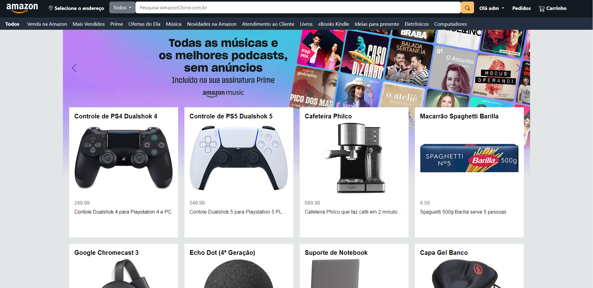

# Clone da Amazon

> Trabalho de PW2 do 5º semestre de 2023 IFG Campus Formosa.

Nesse repositorio você vai encontrar a tentativa de fazer um clone do site da [Amazon.com.br](https://www.amazon.com.br/).

O intuito desse trabalho é botar em prática os nossos conhecimentos sobre PHP, HTML, CSS, Javascript, e MySQL

--------------------------------------------------

### Esse projeto tem o intuito ser um trabalho de faculdade e nada além disso.

## Requisitos

[XAMPP](https://www.apachefriends.org/pt_br/index.html)

Com o XAMPP instalado inicie o Apache e o MySQL.

mova a pasta desse repositorio para a pasta htdocs do local de instalação do XAMPP.

No [localhost/phpmyadmin](http://localhost/phpmyadmin/) crie um novo banco de dados com o nome de db_amazonclone e uft8mb4_general_ci, logo em seguida importe o banco de dados db_amazonclone.sql da pasta database 

## Como usar?
 Com tudo configurado, agora é só acessar o [localhost/amazon-clone](http://localhost/amazon-clone/) no seu navegador.
